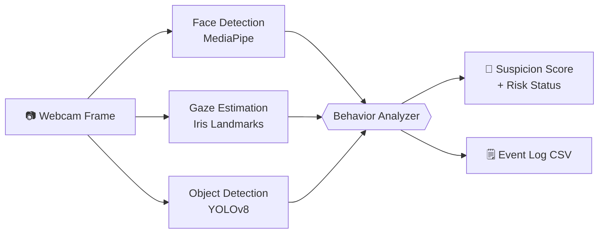

# 🛡️ SentinelVision

**An AI proctoring system — real-time online-exam monitoring that watches a webcam feed and flags suspicious behavior using computer vision.**


SentinelVision analyzes a live camera stream frame-by-frame to detect the behaviors that matter during a remote exam — a candidate leaving the frame, a second person appearing, eyes drifting off-screen, or a phone coming into view — and turns those signals into a running **suspicion score** with a **risk status** (`Normal → Suspicious → High Risk`). Every flagged event is timestamped and written to a CSV audit log.

> Built as a portfolio project to explore practical computer vision end-to-end: face detection, facial-landmark analysis, iris-based gaze estimation, head-pose geometry, and real-time object detection — wired together into a single decision-making pipeline.

---

## 📽️ Demo

> _Add a short screen-recording GIF here (e.g. `assets/demo.gif`) showing the live score and alerts reacting to a phone / looking away._

---

## ✨ Key Features

| Feature | What it does | Tech |
|---|---|---|
| **Face presence & count** | Flags `No face detected` (candidate left) and `Multiple people detected` (someone else in frame) | MediaPipe Face Detection |
| **Gaze tracking** | Uses iris landmarks to estimate Left / Right / Center gaze; sustained off-center looking is flagged as `Looking away` | MediaPipe Face Mesh (refined iris landmarks) |
| **Object / phone detection** | Detects phones, books, and other objects of interest in real time | YOLOv8 (Ultralytics) |
| **Behavior scoring engine** | Converts raw detections into a weighted suspicion score, with a per-event cooldown so one event isn't double-counted | Custom rules engine |
| **Audit logging** | Timestamps every event and object detection to `logs/*.csv` | Python `csv` |
| **Live HUD** | Draws the current score, risk status, and active alerts onto the video feed | OpenCV |

---

## 🧠 How It Works

Each webcam frame is passed through three independent detectors in parallel. Their outputs feed a central **behavior analyzer** that maintains the score and decides the current risk status.



---

## 📊 Detection Logic

The analyzer assigns points to each flagged event and keeps a cumulative score:

| Event | Points |
|---|---:|
| Looking away | +10 |
| No face detected | +20 |
| Multiple people detected | +40 |
| Phone detected | +50 |

A **10-second cooldown** per event type prevents the same continuous behavior from inflating the score every frame.

The cumulative score maps to a risk status:

| Score | Status |
|---|---|
| `0 – 29` | 🟢 Normal |
| `30 – 69` | 🟡 Suspicious |
| `70+` | 🔴 High Risk |

---

## 🛠️ Tech Stack

- **Language:** Python
- **Computer Vision:** OpenCV, MediaPipe (Face Detection, Face Mesh + iris)
- **Object Detection:** Ultralytics YOLOv8 (`yolov8n`)
- **Math / Geometry:** NumPy, `cv2.solvePnP` (head-pose estimation), Eye Aspect Ratio (EAR)
- **Logging:** CSV audit trail

---

## 📁 Project Structure

```
SentinelVision/
├── main.py                          # Entry point — runs the live proctoring loop
├── ROADMAP.md                       # Project plan & milestones
├── requirements.txt
├── requirements-dev.txt             # Test dependencies (pytest)
├── yolov8n.pt                       # Pre-trained YOLOv8 weights (included)
├── docs/
│   ├── DESIGN_NOTES.md              # Architecture, tradeoffs, and glossary
│   ├── DATASETS.md                  # Phase 2 dataset survey, licences, baseline
│   └── ANNOTATION_GUIDE.md          # Labelling protocol for the Phase 2 frames
├── tests/                           # Unit tests (pytest)
├── evaluation/                      # Metrics harness (precision / recall / F1)
├── logs/
│   ├── events.csv                   # Flagged events + running score
│   └── detections.csv               # Raw object detections
└── src/
    ├── vision/
    │   ├── face_detection.py         # Face presence & count
    │   ├── gaze_detection.py         # Gaze direction from face mesh
    │   ├── blink_detection.py        # Blink detection (EAR)        ── built, integration pending
    │   └── head_pose_detection.py    # Head orientation (solvePnP)  ── built, integration pending
    ├── features/
    │   ├── gaze_estimation.py        # Iris-center → gaze ratio
    │   ├── eye_analysis.py           # Eye Aspect Ratio math
    │   └── head_pose.py              # 3D→2D head-pose solver
    ├── object_detection/
    │   └── object_tracker.py         # YOLOv8 inference + logging
    ├── data/                         # Phase 1 — features → windowed training table
    │   ├── feature_extractor.py      # One frame → a row of features
    │   ├── record_session.py         # Log a webcam/video session to CSV
    │   ├── label_clips.py            # Batch-label clips/ from their filenames
    │   └── build_dataset.py          # Frames → sliding time windows
    ├── models/
    │   └── train.py                  # Phase 1 behavior classifier (grouped CV)
    ├── detection/                    # Phase 2 — training a real phone detector
    │   ├── sources.py                # Public-dataset registry + licences
    │   ├── roboflow_import.py        # Fetch Roboflow sets via ROBOFLOW_API_KEY
    │   ├── extract_frames.py         # Mine our clips for the baseline's misses
    │   ├── prepare_dataset.py        # COCO→YOLO, merge sources, clip-grouped split
    │   ├── detection_metrics.py      # IoU / AP@0.5 from scratch
    │   └── train_detector.py         # Fine-tune + compare against the baseline
    ├── behavior/
    │   └── proctor_analyzer.py       # Scoring + risk-status engine
    └── utils/
        ├── event_logger.py           # CSV event logging
        └── geometry.py               # Euclidean distance helper
```

---

## 🚀 Getting Started

**Prerequisites:** Python 3.9+ and a working webcam.

```bash
# 1. Clone the repository
git clone https://github.com/kcosteen/SentinelVision.git
cd SentinelVision

# 2. (Recommended) create and activate a virtual environment
python -m venv .venv
# Windows:
.venv\Scripts\activate
# macOS / Linux:
source .venv/bin/activate

# 3. Install dependencies
pip install -r requirements.txt

# 4. Run
python main.py
```

The webcam window opens with the live score and alerts. **Press `q` to quit.**
The YOLOv8 weights (`yolov8n.pt`) are already included, so no extra download is needed.

---

## 🧪 Testing & Evaluation

The project is measured, not just eyeballed:

```bash
pip install -r requirements-dev.txt

# Run the unit-test suite (geometry, EAR, gaze, scoring engine)
pytest

# Evaluate detection quality — precision / recall / F1 per behavior
python -m evaluation.evaluate
```

Detection quality is scored against human-labeled clips using
**precision / recall / F1** (see [`evaluation/`](evaluation/README.md) for how to
build a labeled test set). Design decisions and tradeoffs are documented in
[`docs/DESIGN_NOTES.md`](docs/DESIGN_NOTES.md).

---

## 🗺️ Roadmap

> Full plan with skills mapped to each phase: [`ROADMAP.md`](ROADMAP.md)

- [x] Real-time face detection & presence checks
- [x] Iris-based gaze estimation (Left / Right / Center)
- [x] YOLOv8 object & phone detection
- [x] Behavior scoring engine with risk status + event logging
- [x] Unit tests + evaluation harness (precision / recall / F1)
- [ ] Replace the rules engine with a trained temporal behavior model
- [ ] Integrate blink-rate & head-pose signals into the live score _(modules already built)_
- [ ] End-of-session summary report
- [ ] Save alert snapshots alongside the CSV log
- [ ] Configurable thresholds & multi-face identity tracking

---

## 📌 Note

This is an **educational / portfolio project** demonstrating computer-vision techniques, not production surveillance software. It runs entirely locally and stores no video — only timestamped event logs. Any real deployment would require explicit consent, privacy safeguards, and far more rigorous validation.
