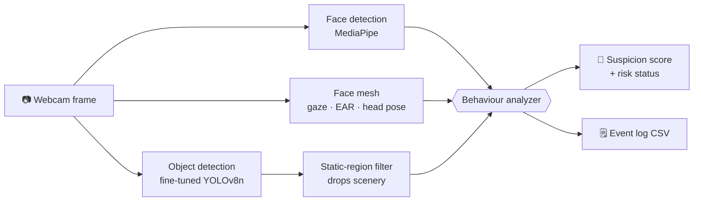

# 🛡️ SentinelVision

**Real-time exam proctoring from a webcam — a fine-tuned object detector plus
facial-landmark geometry, with every decision boundary measured against public
data instead of guessed.**


[](https://huggingface.co/kcosteen/sentinelvision-proctoring-yolov8n)

SentinelVision watches a live camera feed and flags the behaviours that matter in
a remote exam — a candidate leaving frame, a second person appearing, looking
away, or a phone coming into view — turning them into a running suspicion score
with a risk status.

---

## 📈 Headline results

| What | Result | How it was measured |
|---|---|---|
| **Fine-tuned the phone detector** ([weights ↗](https://huggingface.co/kcosteen/sentinelvision-proctoring-yolov8n)) | F1 **0.193 → 0.923** | Both models scored by the same from-scratch AP/F1 code on the same held-out images |
| **Calibrated the decision thresholds** | 3 of 5 measured; the other 2 labelled as guesses | Swept against public labelled datasets, not picked by eye |
| **Diagnosed a domain-shift failure** | 56.4% false-positive rate on an unseen camera | 741 phone-free frames; then fixed structurally, not by tuning |
| **Test coverage** | 132 passing | Pure logic isolated from models, so it runs without a camera |

The point of this project isn't that it wires some vision models together. It's
that **every number above came from a measurement — including the unflattering
ones.**

---

## 🚀 Run it

**Prerequisites:** Python 3.9+ and a webcam.

```bash
git clone https://github.com/kcosteen/SentinelVision.git
cd SentinelVision

python -m venv .venv
.venv\Scripts\activate         # Windows
source .venv/bin/activate       # macOS / Linux

pip install -r requirements.txt
python main.py                  # press q to quit
```

The fine-tuned detector is on the Hugging Face Hub
([`kcosteen/sentinelvision-proctoring-yolov8n`](https://huggingface.co/kcosteen/sentinelvision-proctoring-yolov8n),
model card with full metrics and limitations). Drop it in
`models/detection/` to use it — without it the app falls back to stock COCO
weights and says so loudly, because the two are not interchangeable:

```bash
huggingface-cli download kcosteen/sentinelvision-proctoring-yolov8n   proctoring_yolov8n_best.pt --local-dir models/detection
```

The first ~3 seconds show `Calibrating scene…` while the background filter learns
which parts of the frame never move. After that: turn your head, hold up a phone,
or step out of frame.

```bash
streamlit run app.py            # browser demo — upload a clip
pytest                          # 132 tests, no camera needed
```

---

## 🔬 What was actually measured

### 1. Fine-tuning the detector

Stock COCO YOLOv8n is poor at exam-webcam phone detection, so it was fine-tuned
on a 25,173-frame online-proctoring dataset (CC BY 4.0, 6 classes).

| Model | Precision | Recall | **F1** |
|---|---:|---:|---:|
| Pre-trained YOLOv8n (COCO) | 0.215 | 0.176 | **0.193** |
| **Fine-tuned** | 0.909 | 0.936 | **0.923** |

Two details make that number trustworthy:

- **Both models scored by the same code.** The baseline emits COCO class 67, the
  fine-tune class 1. Scoring both through one from-scratch AP implementation
  ([`detection_metrics.py`](src/detection/detection_metrics.py)) removes any doubt
  about differing conventions or each model's self-reported metric.
- **The split is leak-free.** The dataset's own split drew **100% of validation
  from a single source video** that made up 87% of the data — validating on the
  same person in the same room it trained on.
  [`split_by_source.py`](src/detection/split_by_source.py) regroups so validation
  is people the model never saw.

### 2. Thresholds: measured, not guessed

A threshold is a claim about where suspicious behaviour begins. All of them live
in [`src/thresholds.py`](src/thresholds.py), each tagged CALIBRATED — with the
command that produced it, so it can be re-derived or challenged — or UNCALIBRATED.

| Threshold | Value | Measured against | Result |
|---|---:|---|---|
| Phone confidence | `0.35` | 700 held-out proctoring images | F1 **0.923**; flat 0.25–0.50, a plateau not a knife edge |
| Head yaw "looking away" | `30°` | 463 Gourier head-pose images with ground-truth angles | F1 **0.869** |
| Eye Aspect Ratio "closed" | `0.23` | 1,999 labelled open/closed eyes | F1 **0.979**, Cohen's d **4.11** |
| Iris gaze ratio | `0.35 / 0.65` | — | **UNCALIBRATED** — no public dataset with usable ground truth |
| Score bands | `30 / 70` | — | **UNCALIBRATED** |

The EAR sweep shows why the *shape* of a curve beats its argmax: F1 peaks at 0.25,
but precision falls off a cliff just above it, while the open and closed
distributions leave a wide gap from ~0.16 to ~0.29. `0.23` gives up 0.003 F1 to
sit mid-gap, so a shift from a different camera doesn't cross it.

Head pose was also validated for what it *cannot* do: only the **magnitude** of
yaw is trustworthy. Signed yaw suffers a `cv2.RQDecomp3x3` flip and can't tell
left from right — so the code uses `abs(yaw)`, and says why.

### 3. Where it fails, and why that's in the README

On a camera it had never seen, the detector fired `cell phone` on **56.4% of 741
phone-free frames** — every false positive the same wall shelf. Live it scored
**0.60–0.71**, against a real phone's **0.72–0.79**. Those ranges *touch*, so no
confidence threshold separates them; a blank-background control confirmed the
shelf was the sole source.

The public set's 0.909 precision was a statement about the public set, not about
that room. Textbook domain shift.

**Fixed structurally rather than by tuning.** A shelf is bolted to the wall; a
phone in use is not. [`static_filter.py`](src/object_detection/static_filter.py)
divides the frame into cells and stops reporting detections in cells occupied
continuously for 2 seconds. No per-room configuration — it learns whatever is
nailed down in front of whatever camera it's given.

Three designs were rejected on evidence before that one worked:

| Attempt | Killed by |
|---|---|
| Raise the confidence threshold | Ranges overlap — no cut separates them |
| Track boxes by IoU ≥ 0.80 | Matched only **12%** of consecutive frames: the box *size* thrashes while its centre holds (8px p90) |
| Track boxes by centre proximity | The shelf emits several competing boxes that split and swap — per-box *association* is itself unsound |
| **Occupancy grid, no association at all** | ✅ works |

Two premises had to be corrected along the way:

- **"A phone in use moves" is false.** A phone being *read* is held still — and
  that's the main cheating case. Any detection overlapping the detected person is
  therefore exempt from suppression, however still it's held.
- **"Not seen lately" is not "gone".** Sitting forward occludes the shelf, and a
  short forget-window wiped what had been learned, so it re-flagged on every
  lean-back. Confirmed scenery is now remembered through occlusion.

---

## 🧠 How it works



Each frame is measured by all three, then a rules engine turns the signals into
events. The frame the models measure is kept **pristine**: a bug found here had
face-detection overlays drawn onto the same array YOLO then read, and those ~3,000
altered pixels dropped `person` from 0.63 to no detection at all.

### Scoring

| Event | Points | Signal behind it |
|---|---:|---|
| Gaze off screen | +5 | iris ratio — **uncalibrated**, hence the lowest weight |
| Looking away | +10 | head yaw ≥ 30° — calibrated, F1 0.869 |
| No face detected | +20 | MediaPipe face count |
| Multiple people detected | +40 | MediaPipe face count |
| Phone detected | +50 | fine-tuned YOLOv8n — F1 0.923 |

Weights track how much each signal is **trusted**, not only how bad the behaviour
is. A 10-second cooldown per event stops one continuous behaviour inflating the
score every frame, and the score **decays 2 points/second** while nothing fires —
so it reads as a *current* suspicion level rather than a record of whether
anything ever happened. Sustained behaviour still outruns the decay comfortably.

| Score | Status |
|---|---|
| `0–29` | 🟢 Normal |
| `30–69` | 🟡 Suspicious |
| `70+` | 🔴 High Risk |

---

## 📁 Project structure

```
main.py                      Real-time webcam app
app.py                       Streamlit demo — upload a clip
src/
  thresholds.py              EVERY decision boundary + its provenance
  object_detection/
    object_tracker.py        Fine-tuned YOLOv8 inference
    static_filter.py         Occupancy grid — suppresses scenery
  behavior/
    proctor_analyzer.py      Signals -> events -> score
  features/                  Pure math: gaze ratio, EAR, head pose (solvePnP)
  vision/                    Face detection, gaze
  calibration/               Sweep a threshold against labelled data
  detection/                 Build a dataset, fine-tune, score it
    class_ids.py             Resolve classes by NAME, never by id
  inference/analyze.py       Video -> per-window flags for the demo
evaluation/                  Precision / recall / F1 harness
notebooks/                   Kaggle fine-tuning run
docs/DATASETS.md             Dataset survey, licences, what was rejected and why
docs/DESIGN_NOTES.md         Architecture, tradeoffs, glossary
tests/                       132 tests
```

---

## 🛠️ Tech stack

**Python** · **OpenCV** · **MediaPipe** (face detection, face mesh + iris) ·
**Ultralytics YOLOv8** (fine-tuned) · **NumPy** · `cv2.solvePnP` · **Streamlit** ·
**pytest**

---

## 🗺️ Roadmap

Full plan with skills mapped to each phase: [`ROADMAP.md`](ROADMAP.md)

- [x] Real-time detection: face presence, gaze, head pose, objects
- [x] Evaluation harness — precision / recall / F1 implemented from scratch
- [x] **Fine-tune the detector on a real proctoring dataset & report the delta**
- [x] **Calibrate thresholds against public labelled data**
- [x] Drive the live decision from the calibrated head-pose signal
- [x] Suppress static background false positives
- [ ] Hard negatives from the deployment environment — the honest fix for §3
- [ ] Package the demo as a hosted, clickable link
- [ ] ONNX / quantization, with an FPS-vs-accuracy analysis

---

## 📌 Note

An educational / portfolio project demonstrating computer-vision and ML
engineering, not production surveillance software. It runs entirely locally and
stores no video — only timestamped event logs. Any real deployment would need
explicit consent, privacy safeguards, and considerably more validation than this
has.
